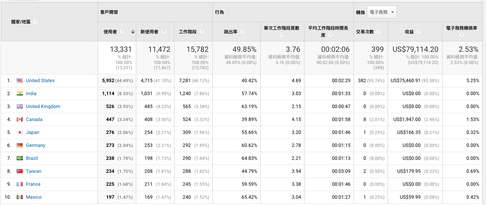
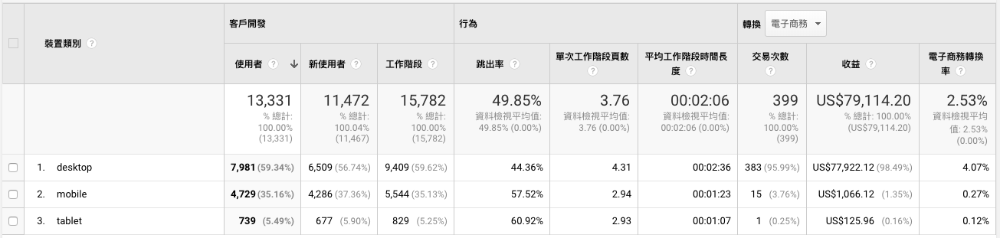
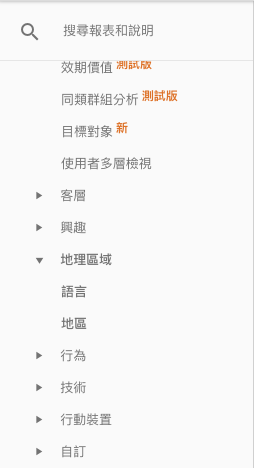
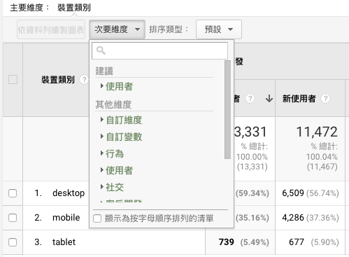
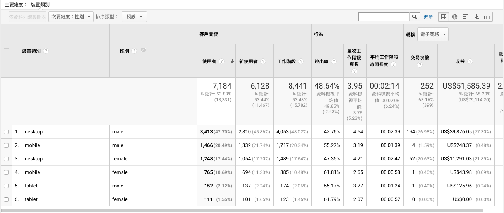

# Chap02. 認識網站分析的「指標」與「維度」

> 次要維度的應用  
> 重要指標介紹

在網站分析裡，常見指標有瀏覽量、工作階段、轉換率、平均工作階段停留時間等，「指標」會用來衡量**訪客質量**，維度則是表示**訪客的特徵**，幫你過濾出訪客族群，例如：訪客年齡、性別、國家。

指標、維度為 Google Analytics 網站分析裡面最重要的兩項核心概念，透過指標、維度可看到網站流量的所有資訊。在其他領域的數據中，甚至會有多種不同的指標。例：年產量、月產量、單位成本、銷售額等。

簡單來說，設定自己想看的維度 (訪客特徵)，接著觀察指標 (訪客質量)，就可形成一個可觀察的報表，加以去了解不同年齡、性別、國家的訪客對你的網站有著什麼不同的價值。

Google Analytics 裡面有數十種常用的指標，包括工作階段、使用者、平均工作階段時間長度等，這些指標提供給分析人員來觀察訪客的「質量」，「維度」則是用來區分及過濾出不同的訪客特徵。

接著看第二個範例：

建議剛接觸 Google Analytics 時，盡可能將所有指標、維度都先認識過一次，在進行資料分析你才會知道有什麼樣的資料可以做觀察、有什麼樣的數據可以做組合。這裡只會介紹重要、常用的幾種。

## 次要維度的應用

了解指標和維度名詞定義後，我們就可來看一下究竟要如何應用這兩個核心數據。

可在 Google Analytics 介面左邊看到的語言、地區報表，都是 Google Analytics 裡面有的「維度」。

以下圖例子說，桌上型電腦、行動裝置的訪客都是我的主要客群，我想要分別看不同裝置訪客的「性別」比例，此時就會同時使用上兩個維度，「次要維度」就派上用場了。

至於什麼樣的維度、指標具有參考價值，必須根據產品而定。你必須要從各個角度思考，自己需要什麼樣的維度，並從中抽絲剝繭，才能找到能帶給你洞察的數據資料。