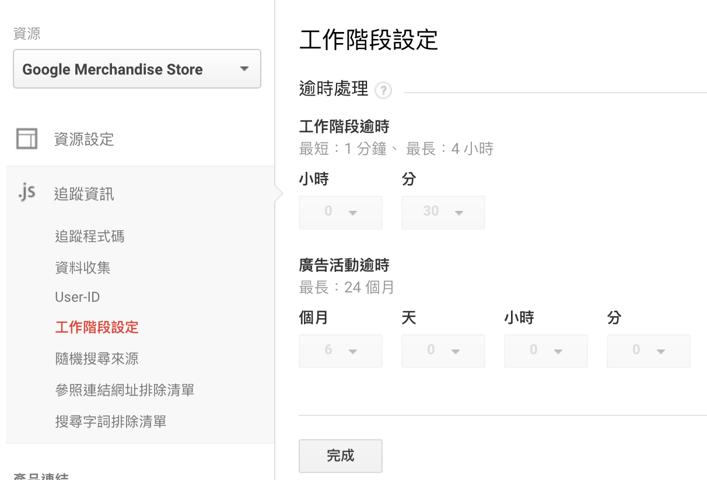
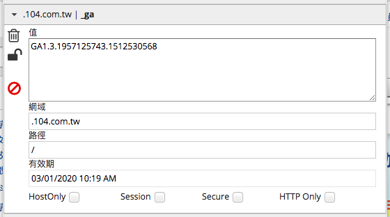

# Chap02. 認識網站分析的「指標」與「維度」

> 次要維度的應用  
> 重要指標介紹

在網站分析裡，常見指標有瀏覽量、工作階段、轉換率、平均工作階段停留時間等，「指標」會用來衡量**訪客質量**，維度則是表示**訪客的特徵**，幫你過濾出訪客族群，例如：訪客年齡、性別、國家。

指標、維度為 Google Analytics 網站分析裡面最重要的兩項核心概念，透過指標、維度可看到網站流量的所有資訊。在其他領域的數據中，甚至會有多種不同的指標。例：年產量、月產量、單位成本、銷售額等。

簡單來說，設定自己想看的維度 (訪客特徵)，接著觀察指標 (訪客質量)，就可形成一個可觀察的報表，加以去了解不同年齡、性別、國家的訪客對你的網站有著什麼不同的價值。

Google Analytics 裡面有數十種常用的指標，包括工作階段、使用者、平均工作階段時間長度等，這些指標提供給分析人員來觀察訪客的「質量」，「維度」則是用來區分及過濾出不同的訪客特徵。

接著看第二個範例：

建議剛接觸 Google Analytics 時，盡可能將所有指標、維度都先認識過一次，在進行資料分析你才會知道有什麼樣的資料可以做觀察、有什麼樣的數據可以做組合。這裡只會介紹重要、常用的幾種。

## 次要維度的應用

了解指標和維度名詞定義後，我們就可來看一下究竟要如何應用這兩個核心數據。

可在 Google Analytics 介面左邊看到的語言、地區報表，都是 Google Analytics 裡面有的「維度」。

以下圖例子說，桌上型電腦、行動裝置的訪客都是我的主要客群，我想要分別看不同裝置訪客的「性別」比例，此時就會同時使用上兩個維度，「次要維度」就派上用場了。

至於什麼樣的維度、指標具有參考價值，必須根據產品而定。你必須要從各個角度思考，自己需要什麼樣的維度，並從中抽絲剝繭，才能找到能帶給你洞察的數據資料。

## 重要指標介紹

這裡先介紹幾個重要的指標。

### -> 工作階段

工作階段是 Google Analytics 裡面最常用的流量指標之一，在做網站分析時，工作階段事實上比「瀏覽量」以及「使用者」這些指標好用，因為它能真實反應訪客使用網站的狀況，前提是：必須要完整了解「工作階段」的定義。

單一工作階段代表使用者在網站內所進行的**一組互動**，這組互動包含網頁瀏覽、點擊等。在「工作階段逾時」之前，訪客的所有瀏覽及互動都算一個工作階段，「工作階段逾時」後，若訪客再次造訪網站則會被視為造成「另一個工作階段」，因此，透過這個指標我們可以準確理解：你的網站究竟在特定時間內產生了多少組的「互動」？每一組互動各自產生多少訂單、停留在網站上多久、哪個流量來源帶來較多的網站互動？

#### 工作階段逾時

一個人到底造成多少個工作階段，是根據工作階段逾時系統而判斷的。至於逾時到底是什麼？以下為會造成工作階段逾時狀況：

- 時間逾時

  系統預設工作階段逾時時間為 30 分鐘，也就是 30 分鐘內，訪客所有的網頁行為、互動皆會被計算為一個工作階段；反之，若訪客超過 30 分鐘沒有網頁互動行為，訪客當前工作階段將會結束，之後若訪客跟網頁產生新的互動，則以新的工作階段計算。

- 新的廣告來源

  如果使用者在網頁瀏覽的過程中，開啟了一個新的廣告活動，舊的工作階段將會逾時，並重新計算為一個新的工作階段。

  意思是從兩個不同來源回訪網站 (也就是產生兩個廣告活動)，就會在短期內造成兩個工作階段。

- 11:59:59

  GA 預設於晚上 11:59:59 秒讓所有工作階段逾時，並開始計算新的工作階段。

> 工作階段持續時間：每當你進行一次網頁互動，Google Analytics 都會從頭計算你的工作階段於逾時。這也代表，工作階段可真實反應出互動的次數，一組工作階段就是一組互動。

#### 如何更改工作階段的設置

從 管理 -> 資源 底下可更改工作階段逾時的時間設定，至於如何決定工作階段逾時時間，則必須根據你的平均工作階段時間長度而定。

### -> 使用者

在 Google Analytics 裡，使用者基本上是指「單一的個人」。舉例，我今天早上拜訪網站 A，晚上又再度拜訪網站 B，那在 Google Analytics 裡，今天造成的數據會被記錄為「1 個使用者」、「2 個工作階段」，但在使用這個指標前，必須知道 Google Analytics 如何判定「使用者」。

當你初次拜訪某網站，Google Analytics 會在你瀏覽器放置一組你獨有的客戶編號 Cookie，它用來協助 Google Analytics 判定你是否為同一使用者。未來你不管拜訪這個網站多少次、產生多少工作階段，只要 Google Analytics 發現你造成的工作階段都來自同一組客戶編號，它就會知道這些工作階段來自於同一個「使用者」。

#### 跨裝置、跨瀏覽器行為追蹤是一大課題

Google Analytics 是利用 Cookie 客戶編號來判定使用者，Cookie 本身是儲存在瀏覽器中的，因此，如果同一個使用者在不同瀏覽器或不同裝置上瀏覽，就會被判定為不同使用者(如圖 2-7)

不同裝置會被認為不同使用者，因此，在使用這個指標前一定要有這樣的概念，才不會對數據有錯誤的認知。

### -> 瀏覽量

瀏覽是指網站的其中一個網頁獲得了一次瀏覽。訪客重新載入會是另一次瀏覽，訪客逛到其他網頁又回訪，也會算是另一次網頁瀏覽。

### -> 跳出率

以 Google Analytics 判定方式，訪客進入你的網站之後，如果沒有到其他頁面更進一步瀏覽就離站，即算跳出。跳出率就是「只瀏覽一頁的訪客」的比例。

訪客到訪的第一頁也就是 GA 裡的「到達網頁 (Landing Page)」，如果有某一頁跳出率特別高，代表使用者進到這個頁面就馬上離開網站，從跳出率我們可觀察哪些頁面需要優化，哪些頁面可以做為行銷活動的到達網頁。

用高於跳出率平均值的網頁去觀察是否需要優化。

### -> 離開率

離開率跟跳出率是不同的指標，離開率是訪客從網頁離開的比例，僅是拿來判斷訪客都是從哪一個頁面離開網站。簡單的說，「離開率」就是你的網頁成為工作階段中「最後瀏覽」的百分比，

假設今天一整天有四個工作階段進到你網頁，Landing Page 都是網頁 A，瀏覽情況如下：

- 工作階段 1：網頁 A -> 離開
- 工作階段 2：網頁 A -> 網頁 B -> 網頁 C -> 離開
- 工作階段 3：網頁 A -> 網頁 B -> 網頁 C -> 離開
- 工作階段 4：網頁 B -> 網頁 A -> 離開

---

- 網頁 A 的跳出率是 33% (工作階段 4 到達網頁不是 網頁 A)
- 網頁 A 的離開率是 50%
- 網頁 C 的離開率是 100%
- 網頁 B 的離開率是 0%

離開率與跳出率是完全分開計算、不同的指標，本身的用法也不同。

### -> 轉換與轉換率

轉換、轉換率是網站分析中非常非常重要的指標，「轉換」在行銷上特指你的網站使用者從「一般使用者」轉換為「對企業有價值的顧客」，簡單來說，轉換意指有多少使用者做到了「企業希望使用者做的目標行動」。

不同網站類型與不同企業，會有不同的轉換目標，以電商的網站來說，轉換通常很單純是使用者「下訂單」，而使用者下多少訂單就意味我們網站得到多少「轉換」。

之後會詳細介紹如何為你的 Google Analytics 設定「轉換」。