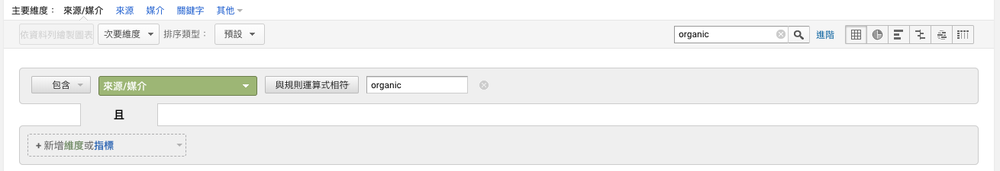

# 如何開始 Google Analytics

> Google Analytics 運作原理  
> Google Analytics 報表頁面說明

## Google Analytics 的運作原理

Google Analytics 是由 JavaScript 所架構而成，當使用者瀏覽網頁，使用者的瀏覽器會載入 Google Analytics 的追蹤碼，這組追蹤碼會幫你記錄使用者的行為，將資料送到 Google Analytics 的資料庫中，經過演算後，就是你在 Google Analytics 裡面看到的各種報表。

瀏覽器載入網頁 -> 瀏覽器讀取到追蹤碼 -> 追蹤碼將資料送到資料庫 -> 資料運算、處理 -> 資料呈現到 Google Analytics

### -> 正確安裝 Google Analytics 的追蹤碼

將 Google Analytics 的追蹤碼安裝在網站上的 `<head>` 底下，因為追蹤碼越早出現在 HTML 中，Google Analytics 就能越早開始收集資料。

以下列出幾個常見的追蹤碼安裝檢查清單給你參考：

- 追蹤碼是否有安裝在 `<head>` 中
- 是否每一個頁面都有安裝追蹤碼
- 你的 404 頁面是否有安裝追蹤碼
- 檢查是否有使用舊版的 Google Analytics 追蹤碼，請確保你是使用最新版的 Google Analytics 追蹤碼 (只要從 Google Analytics 管理介面裡面取得，基本上就是新版)
- 手機版網頁有安裝 Google Analytics 追蹤碼
- 一個頁面上僅安裝一次 Google Analytics 追蹤碼，避免重複安裝
- 確認 Google Analytics 與 Google Tag Manager 沒有同時使用

## Google Analytics 報表介面說明

大致可分為「標準報表」及「特殊報表」。

- 標準報表：功能與操作方式大同小異，只是呈現數據不同
- 特殊報表：依照報表本身的不同、操作與解讀方式都會有所不同

1. 報表切換

    

2. 指標比較

    

    

3. 報表的維度選擇

    

    

    不同網頁會有不同的維度可以選擇。

    

4. 報表本體

    根據所選的維度不同，顯示的數據資料也會跟著變動。

5. 協作功能

    基本上每個報表都有支援儲存、共用、匯出的功能。

    儲存：捷徑的概念，可將常用的報表進行儲存，儲存後報表會出現在 Google Analytics 左側導覽列的「已儲存報表」。

    共用功能：可讓你把資料寄給同事或主管，如果其他部門沒 Google Analytics 權限 or 對 Google Analytics 不熟悉，就可把資料用 mail 方式寄給他們。

    匯出：希望資料用 Excel 處理時。

    

    編輯功能：會自動把你所在的報表設定直接匯入到『自訂報表』讓你進行編輯。因此，利用標及功能可以更快速客製化自己的報表。

6. 時間選擇

    

    

    時間選擇下，數據報表的區塊會顯示兩個區間的資料差異以及成長、下滑的幅度，在行銷活動前後，還是業績突然下滑，都可善用此功能來比較各個不同時間點的數據資料。

7. 時間單位

    

8. 搜尋功能 (又稱為篩選功能)

    在搜尋框輸入任意條件，會幫助你直接篩選出該報表維度的資料。

    

    搜尋 / 篩選功能強大的地方在於，它有進階的篩選功能。

    

    進階搜尋功能中，甚至可以選擇排除或包含符合某些條件的資料列。

    輸入篩選條件時，Google Analytics 提供了不同的比對方式，甚至可用規則運算式來處理。

    除了維度篩選，也可用指標篩選。

    