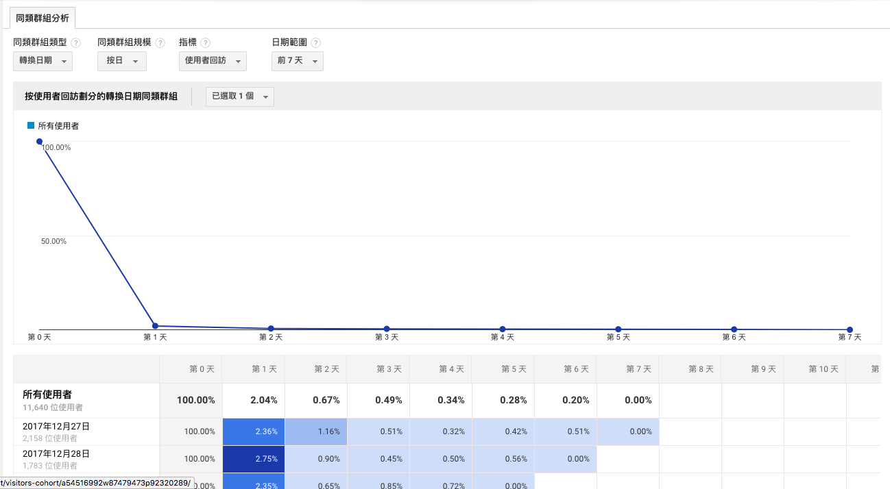
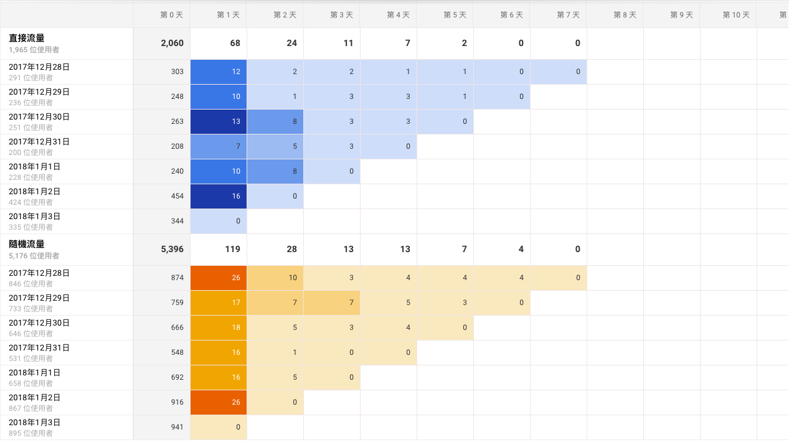
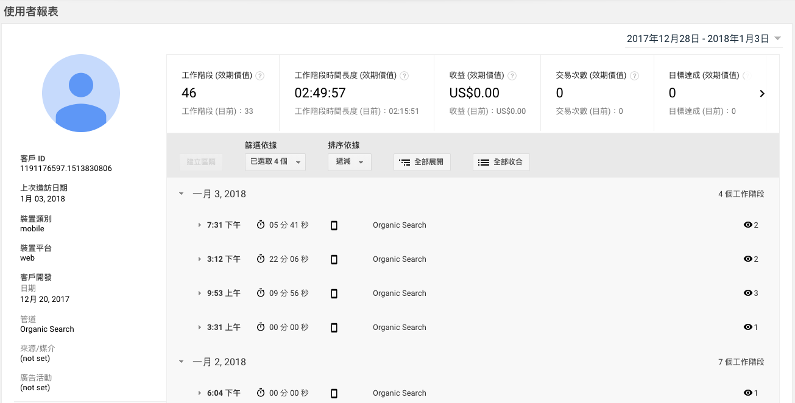

# Chap04. 目標對象 - 使用者分析

> 活躍使用者報表  
> 同類群組分析報表  
> 使用者多層檢視報表  
> 客層、興趣報表  
> 地理區域報表

目標對象報表提供關於**網站訪客的資訊**，包含訪客的性別、年齡、國家 / 地區等，透過目標對象報表，可以描繪出訪客族群的**特徵**，甚至可以做出完整的客群分析。

在擬定網站行銷策略時，可能會透過廣告、SEO、甚至是社群媒體的經營來鎖定各種不同族群背景的消費者，但究竟哪些消費者對我們產生較多的價值呢？就可透過 Google Analytics 的「目標對象」協助你得到更多的洞察力，像以下問題：

- 我的訪客都是分佈在幾歲？性別為何？
- 哪一些年齡層的訪客具有高消費力、高轉換率
- 我在港澳地區投遞廣告、並盡可能地在當地曝光，究竟得到了多少流量與轉換

這裡將介紹最常用、也最實用的幾個報表，其餘沒提到的則是 Google Analytics 的標準報表。

## 活躍使用者報表

活躍使用者報表能告訴你，特定的日期內有多少使用者造訪網站。

假設想觀察的日期為 6/30，這四個指標分別含意為：

- 1 天活躍使用者：6/30 有多少使用者來到我的網站
- 7 天活躍使用者：6/24 - 6/30 有多少使用者來到我的網站
- 14 天活躍使用者：6/17 - 6/30 有多少使用者來到我的網站
- 30 天活躍使用者：6/1 - 6/30  有多少使用者來到我的網站

活躍使用者報表是幫助你實際觀察「使用者」的數據，以及 1 ~ 30 天的使用者分佈，當你有在特定時間進行行銷活動或廣告預算增加時，就可利用此報表來觀察使用者的增減狀況。

(若有人用不同瀏覽器或裝置造訪你的網站，則會被視為多個使用者)。

以上圖來說，我們可看到數據有一些浮動，觀察到這樣狀況，你可以再去查證，該期間是否有什麼狀況，導致使用者大量下滑 / 上升。

### 使用進階區隔，近一步觀察更多資料

你可做出更詳細的資料觀察：

如何運用這個報表，最終還是要依據你的網站行銷活動、流量成長策略及進階區隔的運用，通常在行銷活動的前後或執行特定擬定好的策略時，你可觀察網站使用人數的變化，甚至定期查看這個報表，若察覺到使用者突然變多、變少，你才能更有警覺進一步找出原因、觀察。

波動期間有急速增加或減少的情況，這時應該回頭看看是哪些流量管道突然帶給你較多的流量，或是哪個流量管道的流量突然減少，進一步找出原因。

## 同類群組分析報表

「同類群組分析」本身是指在特定時間內，依照使用者的某些特定行為、特徵，將區分為不同的群組，觀察他們的瀏覽行為、數據，並從中得到更多的洞察力。

譬如說，你今天將「首次造訪網站 24 小時內就完成結帳、購物」的使用者設定為同類群組 A，並將「首次造訪網站 24 小時內沒有完成結帳、購物」的使用者設定為同類群組 B，他們的行為有什麼不同？他們後續的回訪狀況有什麼不同？他們的存留率有什麼不同？這就是“同類群組分析”的概念。

同類群組分析左上有四個選項：

- 同類群組類型：目前只能選擇「轉換日期」作為同類群組類型
- 同類群組規模：可針對日週月觀察報表
- 指標：目前有【回訪率】、【使用者】、【總計】三大種類指標可以使用，你可依照需求來進行調整，這個功能是此報表好用且功能強大的原因之一
- 日期範圍：根據你在「同類群組規模」所選的項目，這個日期範圍的選項會有所不同。可根據前七天、前三週、前六週等不同範圍來觀看數據

### -> 報表解讀

在同類群組分析的報表中，可使用進階區隔來觀看不同維度的流量資料。

第 0 天就是 2017/12/28 當天直接流量產生 303 個工作階段，到第一天同樣一群人產生的工作階段為 12，以此類推。顏色越深代表數字越大。

透過這個報表我們可以看到「在某一天造訪的這群人」他們在之後的第一天、第二天是否有回來繼續產生工作階段、或是產生交易行為。在實務上必須要配合進階區隔，將不同維度 / 特徵的使用者區隔開來，並加以觀察他們的行為數據。

利用不同指標、進階區隔，你可玩出更多花樣，得到更多數據洞察力。

## 使用者多層檢視報表

使用者多層檢視報表會根據 CID 來呈現訪客在網站內的行為數據，讓你可以從「個人」為單位來檢視訪客的網路行為。基本上使用者從進站、瀏覽多少頁面、瀏覽什麼頁面，他們在瀏覽了「哪幾頁」之後完成轉換，這些細節都能透過使用者多層檢視報表來解決。

### -> 了解 Google Analytics 的客戶編號  (Client ID, CID)

每一位使用者在首次造訪某個網站時，該網站會發配給該使用者的瀏覽器一組 CID，並根據這組 CID 來記錄使用者之後在此網站的網站行為、回訪行為。換言之，手機跟 PC 會視為兩個使用者。

在整個 Google Analytics 裡面，只有這個報表可以找到此維度。

點擊多層檢視報表上的任意一個客戶編號後，你就會進入使用者報表。

客戶開發：使用者「初次造訪」的日期，為 2017/12/20。

篩選依據：有四種行為記錄，分別為瀏覽量、目標、電子商務、事件。

上方顯示的工作階段、工作階段時間長度等指標，都是指該使用者在你網站上所累積的數據。以工作階段時間長度，該使用者在網站上「總共」停留了 2 小時 49 分 57 秒。

### -> 該如何使用多層檢視報表？

#### 觀察使用者的消費行為

透過這個報表你可以更細節觀察使用者的瀏覽歷程，它們轉換究竟花了多少天？為什麼回訪多天卻仍然沒有轉換？在轉換前，這些使用者都在瀏覽哪些頁面？

舉例來說，你可使用進階區隔將「沒有轉換的訪客」特別拉出來，觀察他們沒有轉換時，他們是否有回訪、是否有瀏覽網頁？是不是因為商品價格、資訊沒有辦法滿足使用者？

#### 觀察行銷活動、甚至活動頁面的使用者反映

如果想觀察特定廣告進來網站的使用者，都去瀏覽什麼頁面、進行什麼樣的轉換、這些特定使用者後續是否有進行回訪，都可以透過使用者多層檢視報表來觀察。

在使用者多層檢視報表內，你甚至可使用進階區隔，區分開特定族群，觀察特定族群的網站瀏覽行為，加以研究數據，藉以更有效理解使用者、並打造更棒的網站體驗。當然，使用 CID 為單位，在整理資料上肯定會花費不少時間。

## 客層、興趣報表