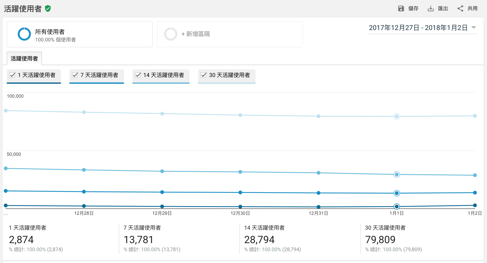
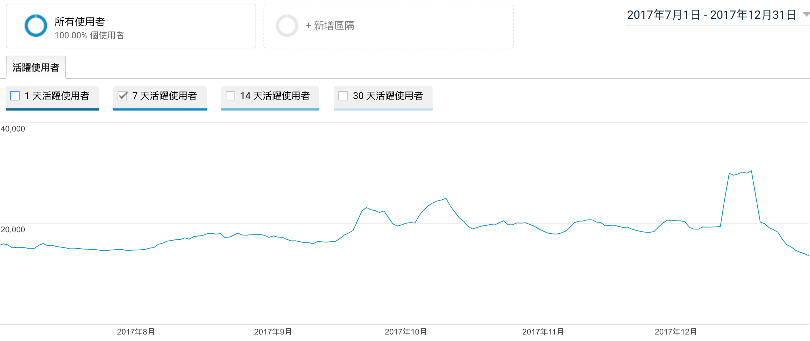
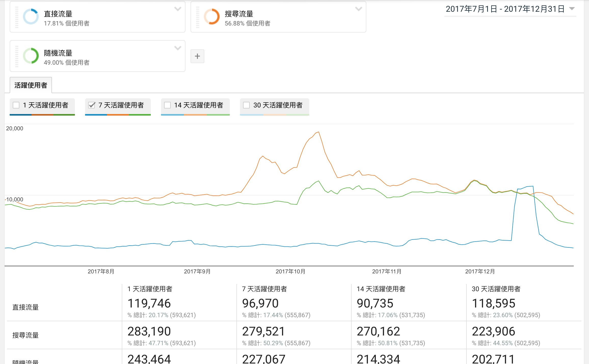

# Chap04. 目標對象 - 使用者分析

> 活躍使用者報表  
> 同類群組分析報表  
> 使用者多層檢視報表  
> 客層、興趣報表  
> 地理區域報表

目標對象報表提供關於**網站訪客的資訊**，包含訪客的性別、年齡、國家 / 地區等，透過目標對象報表，可以描繪出訪客族群的**特徵**，甚至可以做出完整的客群分析。

在擬定網站行銷策略時，可能會透過廣告、SEO、甚至是社群媒體的經營來鎖定各種不同族群背景的消費者，但究竟哪些消費者對我們產生較多的價值呢？就可透過 Google Analytics 的「目標對象」協助你得到更多的洞察力，像以下問題：

- 我的訪客都是分佈在幾歲？性別為何？
- 哪一些年齡層的訪客具有高消費力、高轉換率
- 我在港澳地區投遞廣告、並盡可能地在當地曝光，究竟得到了多少流量與轉換

這裡將介紹最常用、也最實用的幾個報表，其餘沒提到的則是 Google Analytics 的標準報表。

## 活躍使用者報表

活躍使用者報表能告訴你，特定的日期內有多少使用者造訪網站。

假設想觀察的日期為 6/30，這四個指標分別含意為：

- 1 天活躍使用者：6/30 有多少使用者來到我的網站
- 7 天活躍使用者：6/24 - 6/30 有多少使用者來到我的網站
- 14 天活躍使用者：6/17 - 6/30 有多少使用者來到我的網站
- 30 天活躍使用者：6/1 - 6/30  有多少使用者來到我的網站

活躍使用者報表是幫助你實際觀察「使用者」的數據，以及 1 ~ 30 天的使用者分佈，當你有在特定時間進行行銷活動或廣告預算增加時，就可利用此報表來觀察使用者的增減狀況。

(若有人用不同瀏覽器或裝置造訪你的網站，則會被視為多個使用者)。

以上圖來說，我們可看到數據有一些浮動，觀察到這樣狀況，你可以再去查證，該期間是否有什麼狀況，導致使用者大量下滑 / 上升。

### 使用進階區隔，近一步觀察更多資料

你可做出更詳細的資料觀察：

如何運用這個報表，最終還是要依據你的網站行銷活動、流量成長策略及進階區隔的運用，通常在行銷活動的前後或執行特定擬定好的策略時，你可觀察網站使用人數的變化，甚至定期查看這個報表，若察覺到使用者突然變多、變少，你才能更有警覺進一步找出原因、觀察。

波動期間有急速增加或減少的情況，這時應該回頭看看是哪些流量管道突然帶給你較多的流量，或是哪個流量管道的流量突然減少，進一步找出原因。

## 同類群組分析報表

「同類群組分析」本身是指在特定時間內，依照使用者的某些特定行為、特徵，將區分為不同的群組，觀察他們的瀏覽行為、數據，並從中得到更多的洞察力。

譬如說，你今天將「首次造訪網站 24 小時內就完成結帳、購物」的使用者設定為同類群組 A，並將「首次造訪網站 24 小時內沒有完成結帳、購物」的使用者設定為同類群組 B，他們的行為有什麼不同？他們後續的回訪狀況有什麼不同？他們的存留率有什麼不同？這就是“同類群組分析”的概念。